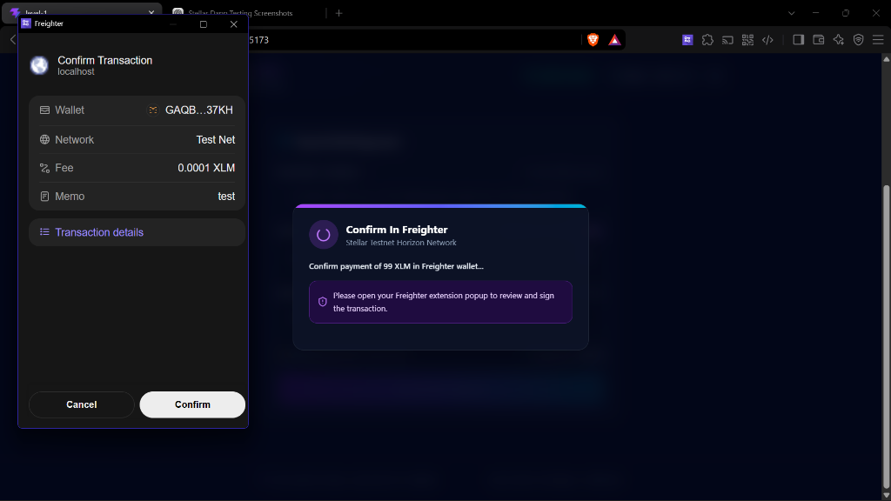
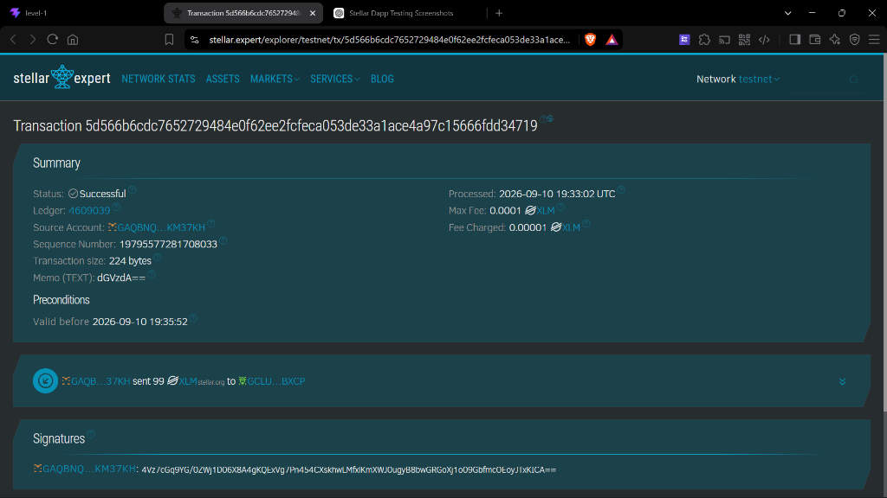
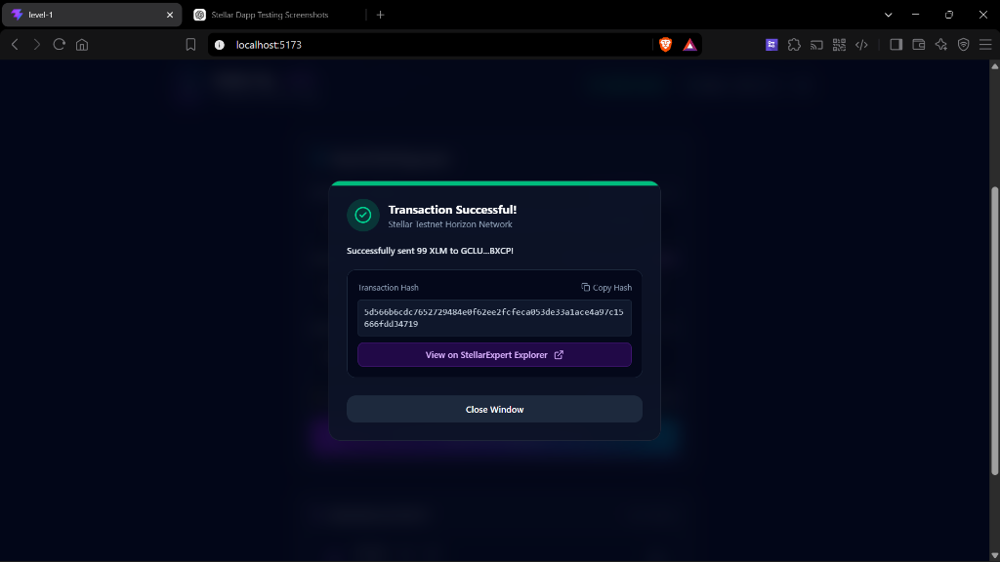

# Stellar Testnet Payment dApp

A simple, secure, and responsive Stellar Testnet payment decentralized application built for the **Rise In Stellar Frontend Challenge — Level 1 White Belt**. The application connects seamlessly with the Freighter browser wallet, displays real-time XLM balances from the Horizon server, calculates minimum reserve requirements using BigInt stroop precision, and builds, signs, and submits payments or account creations on the Stellar Testnet.

## Live Demo

<!-- TODO: paste deployed URL here -->

## Features

- **Freighter Wallet Integration**: Automatic extension detection, session restoration via local persistence, network guard warning against non-testnet configurations, and app-level disconnect handling.
- **Horizon Account Management**: Direct querying of native XLM balances, dynamic calculation of account minimum reserves (`(2 + subentries + sponsoring - sponsored) * 0.5 XLM`), and integrated single-click Testnet Friendbot funding for new accounts.
- **Robust Payment Validation**: Inline validation for Stellar public keys (`G...`), explicit rejection of unsupported Muxed (`M...`) and Contract (`C...`) addresses, self-payment prevention, integer stroop precision math, and byte-length text memo validation (max 28 bytes).
- **Smart Account Handling**: Probing destination accounts before transaction construction to automatically substitute `createAccount` operations with a 1.0 XLM minimum floor when paying unfunded addresses. Automatic retry mechanism if an account is funded mid-flight.
- **Transaction Lifecycle Feedback**: Clear multi-step status feedback (`idle`, `building`, `awaiting-signature`, `submitting`, `success`, `error`), Explorer links for verified transaction hashes, and distinct handling of 504 server timeouts.
- **Horizon Error Code Parsing**: Precise mapping of internal transaction and operation result codes (`tx_insufficient_balance`, `op_underfunded`, `op_low_reserve`, `op_no_destination`) to human-friendly feedback.

## Tech Stack

- **Framework**: React 19 + TypeScript + Vite 6
- **Styling**: Tailwind CSS v4 + Lucide React Icons
- **Stellar Libraries**: `@stellar/stellar-sdk` v13, `@stellar/freighter-api` v6

## Prerequisites

- **Node.js**: Node version `^20.19.0` or `>=22.12.0` (as required by current Vite 6 engines). An `.nvmrc` file is provided in the repository root.
- **Freighter Extension**: The [Freighter Browser Wallet](https://www.freighter.app/) extension installed in your browser.
- **Network Setting**: Freighter switched to **Testnet** (Settings → Network → Testnet).

## Setup

1. Clone the repository:
   ```bash
   git clone https://github.com/<<<YOUR_GITHUB_USERNAME>>>/stellar-payment-dapp.git
   cd stellar-payment-dapp
   ```

2. Install dependencies:
   ```bash
   npm install
   ```

3. Start the local development server:
   ```bash
   npm run dev
   ```

4. Open your browser and navigate to `http://localhost:5173`.

## How to Use

1. Click **Connect Freighter Wallet** in the top navigation header and approve access in the extension popup.
2. If your account is unfunded (0 XLM), click the **Fund with Friendbot** button to receive testnet XLM instantly.
3. Enter a valid destination Stellar public key starting with `G...` (for manual testing, you can use `<<<YOUR_G_ADDRESS>>>`).
4. Enter an XLM amount (or click **Max** to automatically calculate the maximum safe spendable amount after reserves and fees).
5. Optionally add a text memo (max 28 bytes).
6. Click **Send XLM Payment** and approve the transaction in the Freighter popup window.
7. View step-by-step progress, copy the resulting transaction hash, or click the Stellar Expert explorer link to view the transaction on-chain.

## Screenshots


*1. Wallet connected state showing Freighter account address and network status badge.*


*2. Native XLM balance display with active reserve stats and Friendbot funding controls.*


*3. Payment form filled with destination address, calculated Max amount, and memo.*


*4. Successful transaction feedback dialog displaying full transaction hash and Stellar Expert explorer link.*

## How It Works

The dApp operates in a fully non-custodial manner. When a payment is initiated, the application queries the Horizon Testnet server to construct an unsigned XDR transaction containing either a `payment` or `createAccount` operation. The unsigned transaction XDR is passed to the Freighter extension via `@stellar/freighter-api` for client-side signing. Once signed by the user, the application receives the signed XDR from Freighter and submits it directly to the Horizon server. Secret keys never leave the Freighter browser extension and are never accessible to the dApp codebase.

## Testnet Warning

> **Note**: This application operates exclusively on the Stellar Testnet. The Stellar Testnet is a test environment that is periodically reset by the Stellar Development Foundation. A network reset wipes all funded accounts, transactions, and balances, requiring accounts to be re-funded via Friendbot and causing old transaction explorer links to become invalid.

## License

This project is licensed under the [MIT License](LICENSE).
